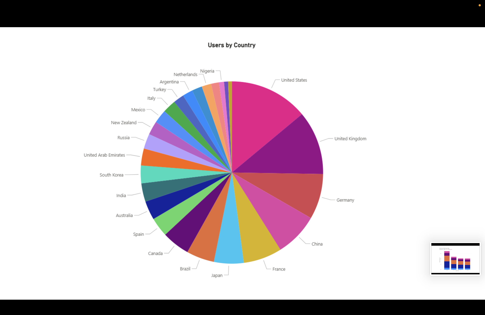
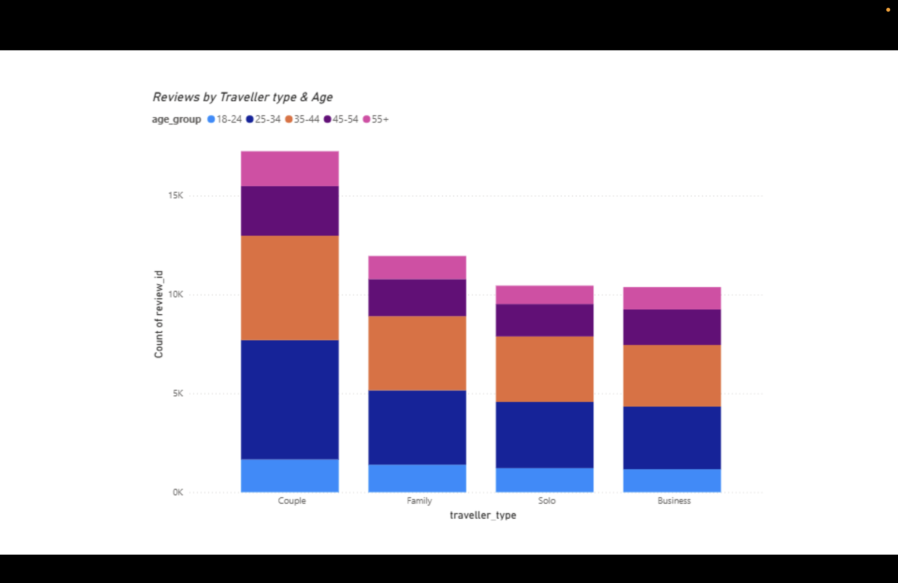
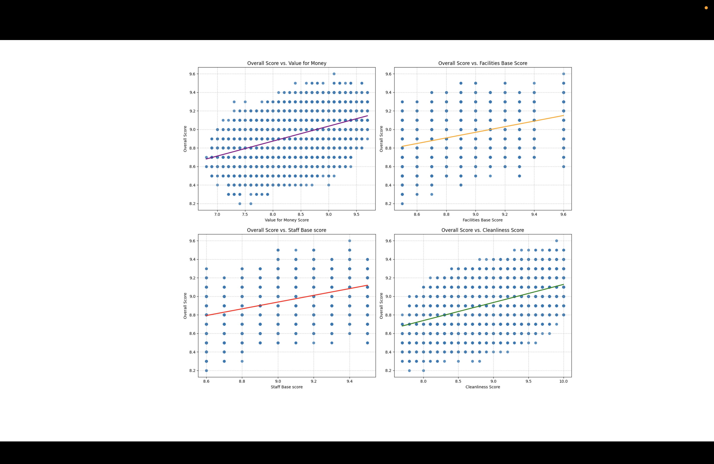
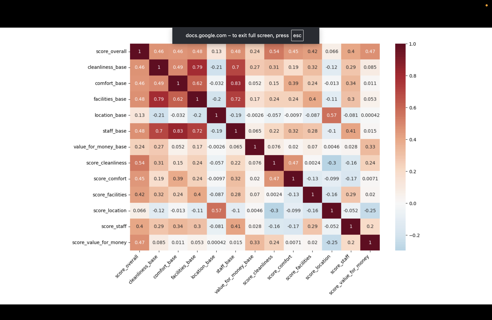

# hotel-booking-analysis
Analyzed hotel booking dataset for trends in reviews and customer satisfaction
# Hotel Booking Analysis

## 📌 Objective
Analyze booking patterns and trends in customer reviews.

## 📊 Dataset
Kaggle Hotel Booking Dataset

## 🛠 Tools Used
- Python
- Pandas
- Matplotlib
- Seaborn
- PowerBI

## 🔍 Key Insights
- Overall Score of hotels highly correlated with Cleanliness and Staff scores
- The overall score tends to be independent of the location of the hotel
  In the predictive model :
- Staff Ratings are providing the majority of the model’s values
- Value for money took priority over Cleanliness and Facilities

## 📈 Visualizations

## 🚀 Business Recommendations
